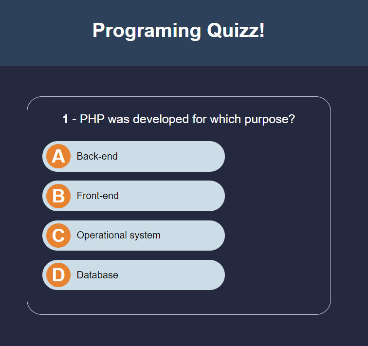
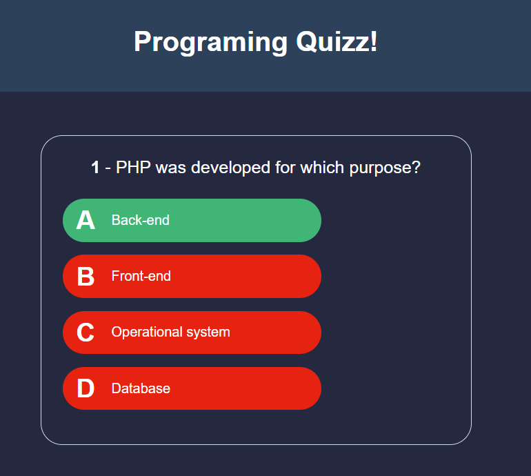
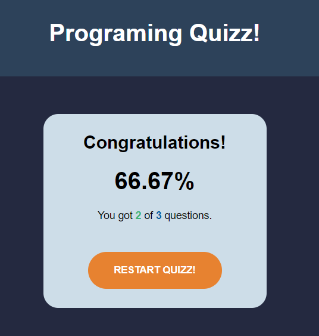
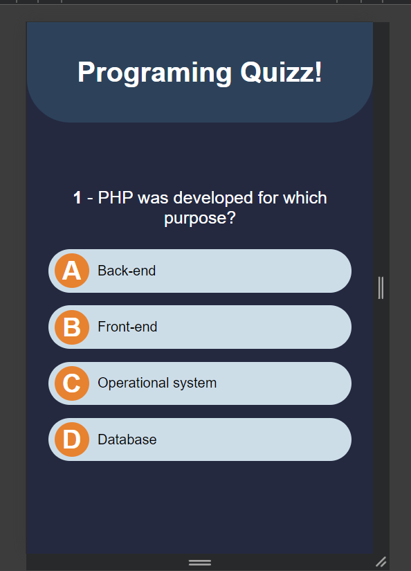

# Quizz em JavaScript

**Descrição**  
Este projeto é uma aplicação web interativa desenvolvida em JavaScript, HTML e CSS. Ele exibe uma série de questões de programação em inglês para os usuários, permitindo que eles testem e melhorem suas habilidades de codificação diretamente no navegador.

## Funcionalidades

- **Exibição das Questões**: As questões de programação são exibidas em um formato amigável, com suporte a código formatado.

- **Interatividade**: Os usuários podem responder às questões e ver os resultados em tempo real.

- **Avaliação Automática**: O projeto inclui uma lógica para avaliar automaticamente as respostas fornecidas.

- **Estilo Responsivo**: A interface é responsiva e adaptável a diferentes tamanhos de tela, proporcionando uma experiência agradável tanto em desktops quanto em dispositivos móveis.


## Tecnologias Utilizadas

- **HTML5**: Estrutura básica da aplicação.
- **CSS3**: Estilização e layout da interface.
- **JavaScript**: Lógica da aplicação e interatividade.

## Como Executar o Projeto

1. **Clone o repositório**  
   ```bash
   git clone https://github.com/MarjoDev/Quizz-Javascript.git
2. **Navegue até o diretório do projeto**
    ```bash
    cd Quizz-Javascript
3. **Abra o arquivo index.html no seu navegador**
    Você pode abrir diretamente o arquivo index.html no seu navegador ou utilizar uma extensão de servidor local como o Live Server no VS Code.

## Estrutura do Projeto
<pre>
root/
│
├── view/
│    ├── css/
│    │    └── styles.css
│    └── img/
│         ├── image.png
│         ├── image-1.png
│         ├── image-2.png
│         └── image-3.png
├── js/
│    └── scripts.js
│
└─ index.html
</pre>
## Contato
Marcelo José Martins Pereira [marjopereira10@gmail.com](mailto:marjopereira10@gmail.com)